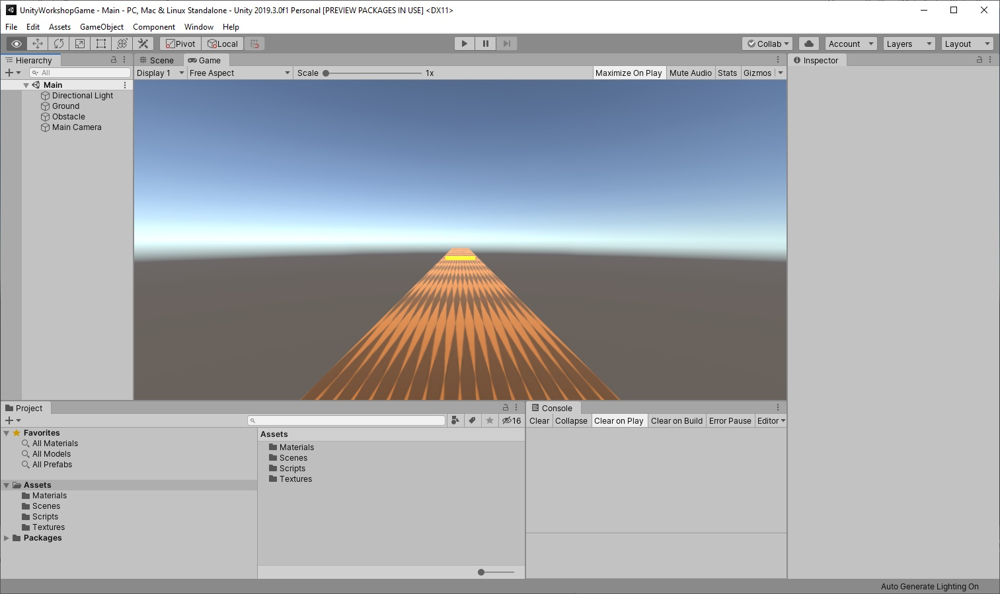
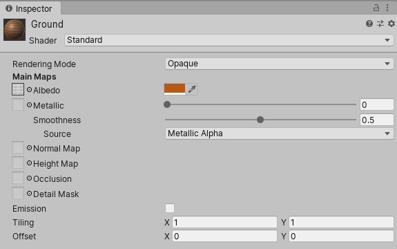
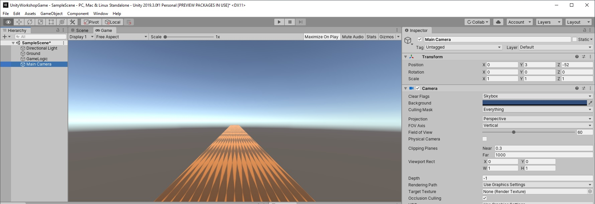
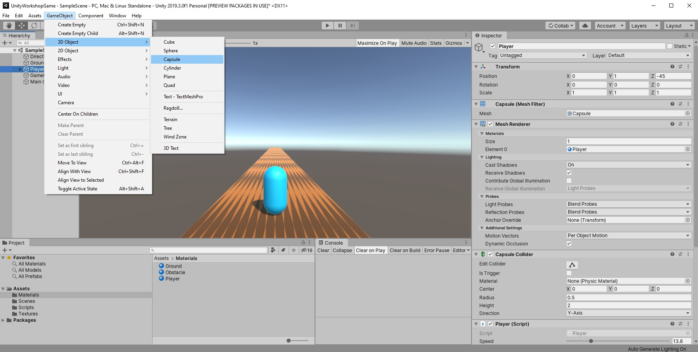
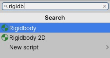
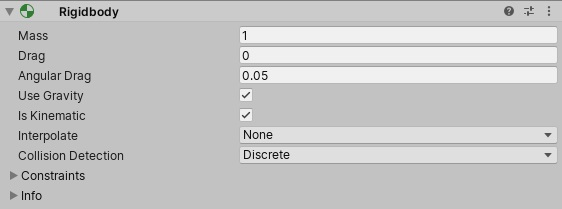

# Unity Workshop - Cambridge GameGig 2019

See the slides in the *Slides* folder for introduction.

# Setup

Download and install Unity3D. Create an Individual / Free account.

# Plan

As time is very limited and there is a lot to learn, we'll aim to do something simple which will cover a few of the main Unity workflows. We'll make a simple mini-game which resembles an infinite runner, where they player most jump over a hurdle.

# Stage 1 - set up environment

This will be the static scene that the gameplay takes place in.

We're going to make the following. The brown object is the floor. The yellow object is a hurdle.

## Breakdown

Add a cube to the scene for a floor:

Ensure the cube is selected in the *Scene* view, then in the Inspector window, set the GameObject name and transform to something like the following.

I decided that the top surface of the cube should be at y=0, hence the y scale of 1.0 and y offset of -0.5.

Lets change the colour of the Ground. In the *Project* view, create a new material asset in a Materials folder using the right-click menu:

Select the new material and in the *Inspector*, set the Albedo (colour) to whatever colour you like. Alternatively, if you want to use a texture, drag the texture into the Project view to import it, and then use the picker to the left of the word Albedo to select it.

Finally position the camera at one end of the Ground by changing the transform of *Main Camera* in the *Inspector* window:

# Stage 2 - set up the player

We'll create a gameobject that represents the player. It will move forward at a constant speed, and jump when the player presses the spacebar.

## Game object setup

There are assets available from Unity for bipeds. In our example we'll simply use a Capsule as a placeholder object to represent the player. Using fast representations like this is common in gamejams. I created a new Capsule using the menu as shown, and placed it at the shown position in the scene, and gave it a blue colour:

The player motion will come from a rigidbody. A rigidbody is an object which interacts with the physics world and collides with physics collision in the screen (this collision comes from *Collider* components which are added to cubes and capsules by default).

With the player gameobject selected, scroll to the bottom of the *Inspector* window and click the Add Component button, and select Rigidbody as shown:

This will make a new section appear in the *Inspector* window for the rigidbody:

The documentation will have details on what these properties do and we won't go through them in detail here.

However a notable option we have selected is the *Is Kinematic* option. This will disable the dynamic physics simulation on this object. It won't roll around by itself, or fall under gravity. One might ask why we use a rigidbody component? For one critical reason - our hurdle that the player needs to jump over will be a *Trigger* that will fire an event on overlaps, and this overlap detection is driven through the physics engine. Our player must have a rigidbody attached so that it is registered with the physics engine, without this no overlap will be detected.

## Behaviour

Our next task is to make the capsule move. Behaviours are authored through C# classes that inherit from *MonoBehaviour* which is the base class for behaviour scripts.

We're going to add a behaviour for the player, which we'll call simply *Player*.

Select the Player gameobject, scroll to the bottom of the *Inspector*, select Add Component, type the name *Player*, and select *New Script* and confirm.

You should see a component called *Player (Script)* appear on the Player gameobject in the Inspector, with a grayed out Script reference with the script name *Player* in the box. Single click the name of the script and it will highlight the referenced script in the *Project* window. Double click it and it should launch a script editor to view the script.

The script should be a simple template that looks follows:

`
using System.Collections;
using System.Collections.Generic;
using UnityEngine;

public class Player : MonoBehaviour
{
    // Start is called before the first frame update
    void Start()
    {
        
    }

    // Update is called once per frame
    void Update()
    {
        
    }
}
`

The function names *Start* and *Update* are special names. Unity will detect these and call *Start* just before the first time the behaviour starts updating, and will call *Update* every frame. There are many special functions that you can add, see the documentation for more detail: https://docs.unity3d.com/ScriptReference/MonoBehaviour.html

